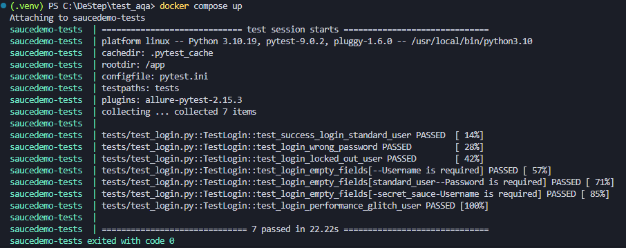
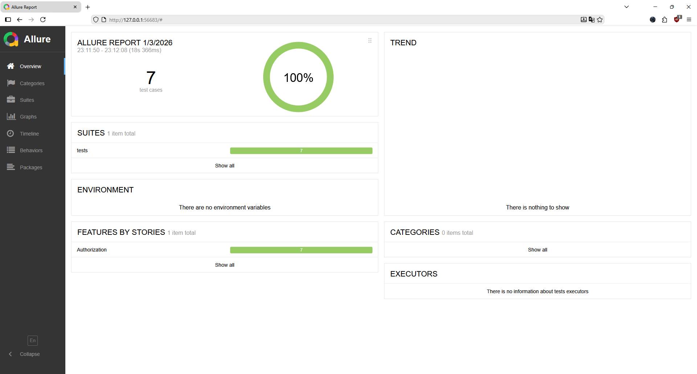

# SauceDemo Login Autotests
Playwright · Pytest · Allure · Docker

Автотесты сценариев авторизации для сайта:
https://www.saucedemo.com/

Проект демонстрирует:
- UI-тестирование в реальном браузере (Chromium) через Playwright
- организацию кода по паттерну Page Object
- генерацию Allure-отчёта
- запуск в Docker / Docker Compose

---

## Технологии

- Python 3.10
- Playwright (Chromium)
- Pytest
- Allure (allure-pytest)
- Docker / Docker Compose
- Page Object (pages/*)

---

## 📁 Структура проекта

```text
.
├─ pages/
│  ├─ base_page.py          # базовые методы (open, ожидания, проверки)
│  ├─ login_page.py         # Page Object страницы логина
│  └─ inventory_page.py     # Page Object страницы товаров (inventory)
├─ tests/
│  └─ test_login.py         # тесты авторизации
├─ conftest.py              # фикстуры (page, base_url), настройки браузера
├─ pytest.ini               # настройки pytest (например, verbose/quiet)
├─ requirements.txt         # зависимости Python
├─ Dockerfile               # сборка окружения для запуска тестов
└─ docker-compose.yml       # удобный запуск одной командой
```

---

## Набор тестов и что проверяется

Тесты покрывают сценарии авторизации:

1) **Успешный логин**: `standard_user / secret_sauce`
- открытие страницы логина
- ввод корректных данных
- переход на `/inventory.html`
- проверка отображения ключевых элементов каталога (например, заголовок **Products**)

2) **Неверный пароль**
- ввод корректного username и неверного password
- остаёмся на странице логина
- проверка появления сообщения об ошибке

3) **Заблокированный пользователь**: `locked_out_user`
- попытка логина
- остаёмся на странице логина
- проверка текста ошибки о блокировке

4) **Пустые поля**
- проверка валидации формы при пустом username и/или password
- реализовано параметризацией (несколько кейсов)

5) **`performance_glitch_user`**
- проверка успешного логина и корректного перехода на `/inventory.html`
- тест учитывает возможные задержки загрузки страницы

Дополнительно в тестах проверяется:
- корректность URL после действия (login или inventory)
- видимость ключевых элементов на страницах
- сообщения об ошибках при негативных сценариях

---

## Запуск проекта (подробная инструкция)

Ниже два варианта: локально и через Docker.

---

### Вариант A: Локальный запуск (Windows / Linux / Mac)

#### 1) Создать виртуальное окружение

Windows (PowerShell):
```bash
py -3.10 -m venv .venv
.venv\Scripts\Activate.ps1
```

Linux / Mac:
```bash
python3.10 -m venv .venv
source .venv/bin/activate
```

#### 2) Установить зависимости
```bash
pip install -r requirements.txt
```

#### 3) Установить браузер Playwright (Chromium)
```bash
python -m playwright install chromium
```

#### 4) Запустить тесты

Короткий вывод:
```bash
pytest -q --alluredir=allure-results
```

Подробный вывод:
```bash
pytest -vv --alluredir=allure-results
```

---

### Вариант B: Запуск в Docker Compose (рекомендуется для проверки)

#### Запуск
```bash
docker compose up --abort-on-container-exit
```

После выполнения:
- тесты завершатся
- результаты Allure сохранятся в папку `allure-results` (если volume настроен в compose)
- код возврата контейнера `0` означает, что все тесты прошли

---

## 📊 Allure отчёт

### 1) Генерация результатов
Результаты пишутся при запуске pytest с ключом:
```bash
--alluredir=allure-results
```

### 2) Просмотр отчёта
Нужен установленный Allure CLI.

Проверка установки:
```bash
allure --version
```

Открыть отчёт:
```bash
allure serve allure-results
```

Если команда `allure` не находится на Windows, установите Allure CLI, например через Scoop:
```powershell
Set-ExecutionPolicy RemoteSigned -Scope CurrentUser
irm get.scoop.sh | iex
scoop install allure
```

---

## Результаты выполнения тестов

### Вывод в терминале



### Allure Report


